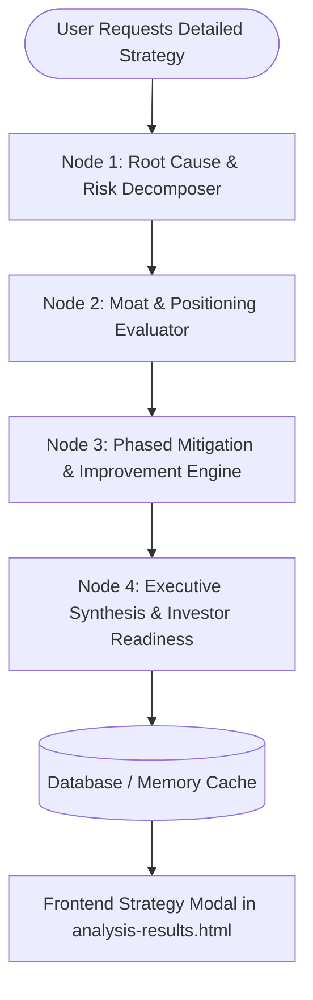

# Implementation Plan - Milestone 3: LangGraph Strategic Advisor & Mitigation Engine

This milestone upgrades `smart_failure_detection` with an agentic LLM reasoning layer powered by **LangGraph**. It orchestrates a multi-stage analysis pipeline to dissect root causes, assess competitive positioning, generate concrete phased mitigation roadmaps, and present executive strategic recommendations in the UI.

## User Review Required

> [!IMPORTANT]
> **LLM Provider & Key Handling**: The LangGraph workflow will support **Google Gemini** (`GEMINI_API_KEY`) and **OpenAI** (`OPENAI_API_KEY`) via standard environment variables. Additionally, a robust **offline heuristic fallback reasoning engine** is included so the entire workflow executes seamlessly even if no API key is provided during local testing.

> [!NOTE]
> **Modular Architecture**: Rather than inflating [`main.py`](file:///c:/Users/hp/Downloads/new%20test/main.py) further (currently ~838 lines), we will extract the agentic reasoning and graph pipeline into a dedicated module [`strategy_engine.py`](file:///c:/Users/hp/Downloads/new%20test/strategy_engine.py) and clean up dependency declarations in [`requirements.txt`](file:///c:/Users/hp/Downloads/new%20test/requirements.txt).

---

## Architecture & Workflow Design



### LangGraph State Schema
```python
class StrategyState(TypedDict):
    project: dict
    milestone2_analysis: dict
    root_causes: list[dict]
    positioning: dict
    mitigation_roadmap: list[dict]
    executive_verdict: dict
    confidence: int
```

---

## Proposed Changes

### Backend: Agentic Strategy Engine

#### [NEW] [strategy_engine.py](file:///c:/Users/hp/Downloads/new%20test/strategy_engine.py)
- Defines the `StateGraph` containing 4 specialized analytical nodes:
  1. `analyze_root_causes`: Identifies primary vulnerabilities from the Rule Engine outputs.
  2. `evaluate_positioning`: Evaluates competitive defensibility, moat potential, and market positioning.
  3. `generate_mitigation_roadmap`: Generates a concrete 3-phase action plan (0-30 days immediate fixes, 30-60 days operational stabilization, 60-90+ days growth & de-risking).
  4. `synthesize_executive_strategy`: Produces executive summary, strategic recommendation score, and bull/bear sensitivity forecast.
- Provides fallback deterministic reasoning if LLM API is unavailable.

#### [NEW] [requirements.txt](file:///c:/Users/hp/Downloads/new%20test/requirements.txt)
- Declares core dependencies: `fastapi`, `uvicorn`, `psycopg2-binary`, `pydantic`, `langgraph`, `langchain-core`, `python-dotenv`.

#### [MODIFY] [main.py](file:///c:/Users/hp/Downloads/new%20test/main.py)
- Add route `GET /api/analysis/{project_id}/strategy` and `POST /api/analysis/{project_id}/strategy/regenerate`.
- Integrates `strategy_engine.run_strategy_graph(project, milestone2_analysis)`.
- Implements response caching to avoid redundant re-generation.

---

### Frontend: Interactive Strategy Modal

#### [MODIFY] [analysis-results.html](file:///c:/Users/hp/Downloads/new%20test/analysis-results.html)
- Replace placeholder alert on `#viewExplanationBtn` with a slide-out modal / overlay drawer.
- Renders:
  - **Executive Strategic Verdict & Bull/Bear Scenarios**
  - **Deep-dive Root Cause Breakdown Cards**
  - **Phased Mitigation Roadmap Timeline** (with actionable task checklists)
  - **Moat & Defensibility Playbook**
  - **Regenerate Strategy Button** with visual progress indicator / skeleton loader.

---

## Verification Plan

### Automated Tests
1. Unit test script [`test_strategy_graph.py`](file:///c:/Users/hp/Downloads/new%20test/test_strategy_graph.py):
   - Tests LangGraph execution on sample startup payloads.
   - Asserts state keys, non-empty mitigation roadmaps, and valid output structure.
   - Tests fallback mode execution when API keys are absent.

### Manual Verification
1. Start FastAPI server (`uvicorn main:app`).
2. Submit a new project via [`index.html`](file:///c:/Users/hp/Downloads/new%20test/index.html).
3. Navigate to [`analysis-results.html`](file:///c:/Users/hp/Downloads/new%20test/analysis-results.html) and click **"View Detailed Strategy & Reasoning"**.
4. Verify that the LangGraph workflow triggers, displays loading animations, and renders the structured multi-phase strategic mitigation roadmap.
